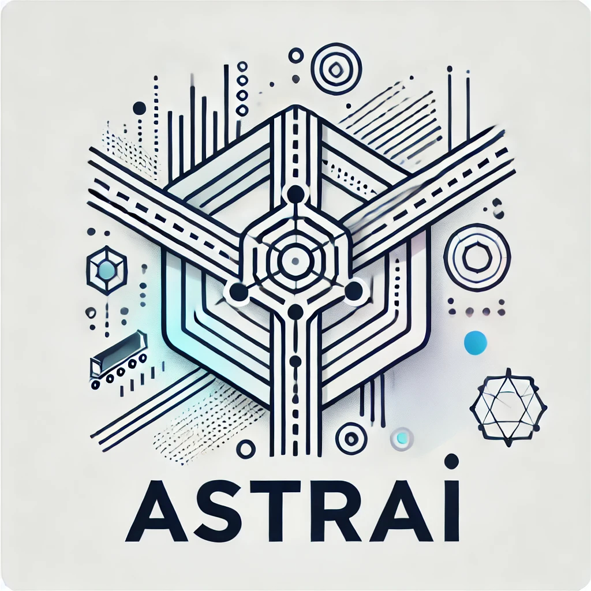

  

# The Art and Science of Transportation Research in the AI Era

:mortar_board: 6-CP seminar (Winter Semester 2026/27)\
:clock1130: Wednesdays 11:40-15:00\
:school: L402/231

## Course description

In today’s rapidly evolving AI-mediated world, the way of conducting scientific research is undergoing significant transformation. The ability to understand fundamental concepts in research design and methodology, while harnessing emerging computational techniques and tools, is crucial for addressing contemporary challenges and advancing knowledge across various fields. This seminar "The Art and Science of Transportation Research in the AI Era" (ASTRAI) responds to the need to prepare you to thrive in a rapidly evolving, technology-driven world by integrating computational and data science techniques into your studies. While the examples primarily focus on transportation, the techniques and methods are transferable across disciplines.

This seminar covers the key concepts in research design and methodology, such as operational definitions, measurements, and generalizability, and exposes you to a variety of computational techniques, such as web scraping, data wrangling in Python, and version control with git.

The goal of this seminar is not to create programmers or computational engineers, but rather to familiarize and de-mystify computational methods and data science techniques by striking a balance between the "how to" and the "why." So, in essence, this course aims to empower you to understand and apply these methods and techniques effectively within your respective fields of study. By the end of the course, you will:

*	Illustrate the fundamental concepts in research design and methodology.
*	Effectively formulate research questions and design a study.
*	Develop proficiency in data science tools and techniques.

## Required literature

This class has no required textbook. We will direct you toward online resources when necessary.

## Course activities

**Class participation**: Active class participation is critical to the success of this course. As such, you are expected to attend class every week, bring your laptop and its power cord, and actively participate in the in-class activities.

**Pre-class requirement**: From time to time, you will need to sign up for accounts or install essential software before class so that we can focus on implementation and experimentation in class.

**In-class activities**: Practicing coding, debugging, discussions, etc. This allows you to immediately implement and get feedback on what you have just learned.

**Student-led learning (YOU-lead)**: You are expected to present the computational research method that serves as the method of your research proposal (i.e., your exam) and the software through which it will be implemented. You will **study the method and software in depth** and **explain them to your peers in class**. This approach allows you to take ownership of your learning while fostering a collaborative learning environment, and it feeds directly into the proposal you submit for examination. Good performance in this presentation can improve your final grade by up to 0.4 points.

**Final examination**: You are required to develop a one-page research proposal (excluding references) on a topic of your choice. The proposal must incorporate the computational method you studied and presented in class. It should cover the current state of research on the topic, the research questions, the methodology (including data sources and the software used), and the limitations of the chosen method.

## Possible topics for YOU-lead sessions

Your choice can be anything within the scope of this course, as long as it is **the method your final research proposal will build on**. The following are some examples.

**Methods**: machine learning, agent-based modeling, traffic simulation, spatial analysis.

**Software**: scikit-learn or PyTorch (machine learning), NetLogo (agent-based modeling), SUMO (traffic simulation), GeoPandas (spatial analysis).

## Schedule

The schedule and topics may change based on class progress and interests.

Week 1 (Oct 14, 2026): Welcome to ASTRAI

Week 2 (Oct 21, 2026): `git`; presenting your initial ideas for YOU-lead

Week 3 (Oct 28, 2026): Traffic flow simulation ([Dr.-Ing. Wei Jiang](https://www.linkedin.com/in/wei-jiang-52083a32/))

Week 4 (Nov 4, 2026): Gaming for science ([M.Sc. Vijay Palliyil](https://www.verkehr.tu-darmstadt.de/vv/das_institut_ivv/team_ivv/wissenschaftliche_mitarbeiter_doktoranden/m__sc___vijay_gopal_vazhoth_palliyil/.en.jsp))

Week 5 (Nov 11, 2026): Python basics (asynchronous self-study session)

Week 6 (Nov 18, 2026): Web scraping

Week 7 (Nov 25, 2026): Data wrangling; signing up for a YOU-lead slot

Week 8 (Dec 2, 2026): Open-source tools

Week 9 (Dec 9, 2026): Research design and methodology; confirming your topic for YOU-lead

Week 10 (Dec 16, 2026): Machine learning, AI, and LLMs

Week 11 (Jan 13, 2027): YOU-lead session

Week 12 (Jan 20, 2027): YOU-lead session

Week 13 (Jan 27, 2027): YOU-lead session

Week 14 (Feb 3, 2027): YOU-lead session

Week 15 (Feb 10, 2027): Working on your proposal

## FAQs

**How to pronounce ASTRAI?**

A stray (meaning wandering around in AI) or ashtray (meaning we have smoking hot topics). You pick.

**Who is this course for?**

There are people who love coding to the moon and back. And there are people who hate coding to death. This course is for the people in the middle, those who appreciate the value of computational methods and are willing to explore but may feel unsure about where to start.

**With so many free resources available online, what is the value of this course?**

*	The organization of content
*	The filtering of information
*	Direct access to instructors and peers for questions and discussions
